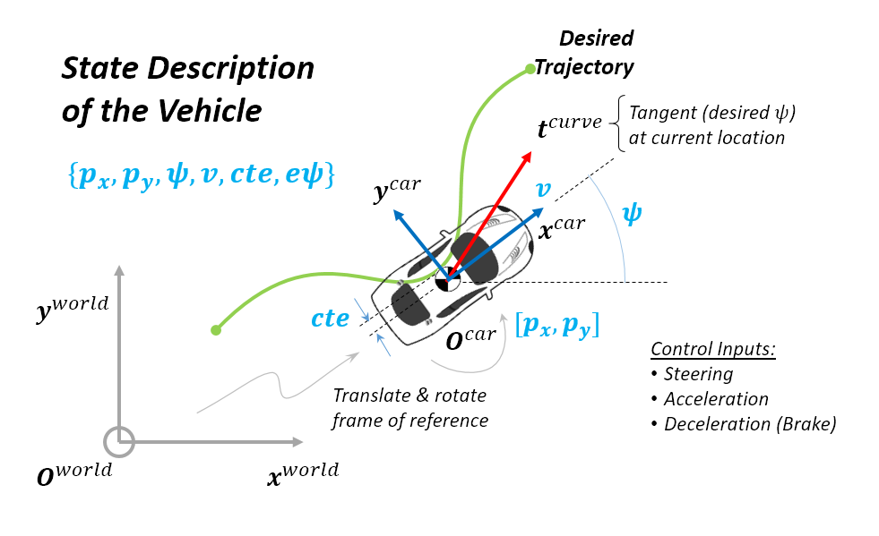

# 1. Term 2 MPC Controls Project Overview

This writeup is divided into the following sections.

  - [1. Configuration, Build and Run Process](#1-configuration-build-and-run-process)
  - [2. Source Code Implementation](#2-source-code-implementation)
      - [2.1. Implementation of MPC Class (FG_eval and Solver)](#21-implementation-of-mpc-class-fg_eval-and-solver)
      - [2.2. Hyperparameters Tuning](#22-hyperparameters-tuning)
      - [2.3. Telemetry Data, Optimization & Visualization](#23-telemetry-data-optimization--visualization)
  - [3. Results and Discussions](#3-results-and-discussions)

---

## 1. Configuration, Build and Run Process

* For this project, mac build environment was used. The core dependencies (cmake >=3.5, make >= 4.1, gcc/g++ >= 5.4) are already a part of this system.
* [uWebSockets](https://github.com/uWebSockets/uWebSockets) was installed using `install-mac.sh` Some minor local 
changes had to be performed for my local environment. I have checked in my changes in install-mac.sh
* [Ipopt](https://projects.coin-or.org/Ipopt) brew install 
* [CppAD](https://www.coin-or.org/CppAD/) brew install.
* [Eigen](http://eigen.tuxfamily.org/index.php?title=Main_Page). This is already part of the repo so you shouldn't have to worry about it.
* The term 2 simulator was downloaded from the [release](https://github.com/udacity/self-driving-car-sim/releases) section of the repository.
* The build for MPC project was done  using command `mkdir build && cd build && cmake .. && make`. The executable was run using `./mpc`. The executable (server) waits for uWebSockets connection from Term 2 Simulation (client). Once connection is established, the executable receives "telemetry" data from the client and sends back "steer" command data.
* Updated the install-mac.sh and CMakeList.txt 
    * Added openssl location as per my local installs
* Had to switch to brew science (brew tap homebrew/science)
    * Then brew install ipopt and cppad packages
* build and run in cLion IDE

## 2. Source Code Implementation

The source code implementation was done as follows:

1. The first part of the implementation is in the file `MPC.cpp`, which defines the `FG_eval` and the `MPC` class implementation. In this file, the cost objective, constraints and the Ipopt optimization solver details are implemented.
2. Implementation of the tunable hyper parameters in the file `mpc_tuning_params.cpp`.
3. The final aspect of implementation is the telemetry data management, optimization/prediction and visualization in the file `main.cpp`.

### 2.1. Implementation of MPC Class (FG_eval and Solver)
The details have already been documented [elsewhere](https://github.com/ahararwala/CarND-MPC-Quizzes) and will <u>not</u> be discussed in this file in detail.

### 2.2. Hyper parameters Tuning

The following code block lists the section of the code for hyper parameter definition. The number of future timesteps for prediction is set to `TIME_STEP_DURATION=10`. Further, the time intervals for future prediction is 200ms. The combination of `N*DT` gives about 2 secs of prediction horizon, which for most practical case is optimal. Too small a horizon will lead to instability & too large a horizon will be unnecessary in dynamically chaning environment, e.g., busy pedestrian crossing / intersection. Out of three different configurations: `N=20, DT=0.05`, `N=10, DT=0.2` and `TIME_STEP_DURATION=20, DT=0.1`, the chosen one gave best performance. To account for controller latency and predict control inputs, 100ms time delay is used.

The critical cost penalty imposed to minimize sudden changes in steering (`LAMBDA_DDELTA`) is set to 5000. All other cost penalty parameters are held at 1. The reference speed to the vehicle can also be tune here to assess controller stability.

``` c++
  // Set the timestep length and duration
  const size_t TIME_STEP_DURATION = 10;
  const double DT = 0.2;
  const double DT_LATENCY = 0.1;

  // Cost penalties for cte, epsi and v_start
  const double LAMBDA_CTE = 1.0;
  const double LAMBDA_EPSI = 1.0;
  const double LAMBDA_V = 1.0;    

  // Additional hyperparameters to penalize agressive maneuvers
  // Following lambda's are Lagrange multipliers for the optimizer
  // Cost penalties to minimize use of steering and acceleration
  const double LAMBDA_DELTA = 1.0;
  const double LAMBDA_A = 1.0;
  // Cost penalties to minimize sudden changes in steering and acceleration
  const double LAMBDA_DDELTA = 5000.0;
  const double LAMBDA_DA = 1.0;

  // Length from front to CoG that has a similar radius.
  const double LF = 2.67;

  // Reference (target steady state) velocity
  const double REF_CTE = 0.0;
  const double REF_EPSI = 0.0;
  const double REF_V = 60.0 * 0.44704; // convert mph to m/s
```

### 2.3. Telemetry Data, Optimization & Visualization

The telemetry data from client is received by the server and processed in lines 91-99. In addition to telemetry data already defined in the starter code, additionally, steering angle values is also extracted (see lines 98 & 99) based on information from [DATA.md](https://github.com/ahararwala/CarND-MPC-Project/blob/master/DATA.md).

All data processing, optimization and predictions are done in the vehicle coordinate frame. Since the telemetry data is in the world or global coordinate frame, reference trajectory point data is transformed to vehicle coordinate frames in lines 103-107. Note that both translations and rotation (by `phi`) are accounted. In line 11, a 3rd degree polynomial is fitted to these points. A summary of the state variables and the trasnformation from global to vehicle coordinate frame is shown in the following figure.



To account for latency, a future state at `t+100ms` is predicted from lines 114-127. Note that these equations are same as those introduced in the class, but certain assumptions mean that few terms in the equations are 0.0.

The optimized state information is returned by the MPC controller optimization solver (see line 129) in the variable `vars`. The immediate predicted control inputs (steering & throttle), with latency of 100ms, are sent back to client in lines 138-139. Also, the precited trajectory and the reference trajectory line are passed back to the client  for visualization in lines 142-162.

## 3. Results and Discussions

The implementation of the MPC controller was used to successfully complete multiple laps of the lake track. I investigated multiple speeds between 30 MPH and 60 MPH with an increment of 5 MPH. 
The controller is stable until speed of 55 MPH. 
Then there are signs of degradation at 60 MPH.

At speeds above 60 MPH, the controller becomes unstable at sharp turns. This is attributed to latency and processing delays in the controller. This can perhaps be improve further by putting a constraint on the throttle depending on the curvature of the 3rd degree polynomial use to fit reference trajectory. The optimizer will seek lower throttle (and hence speed) before sharp turns. This will be implemented in future endeavours.
